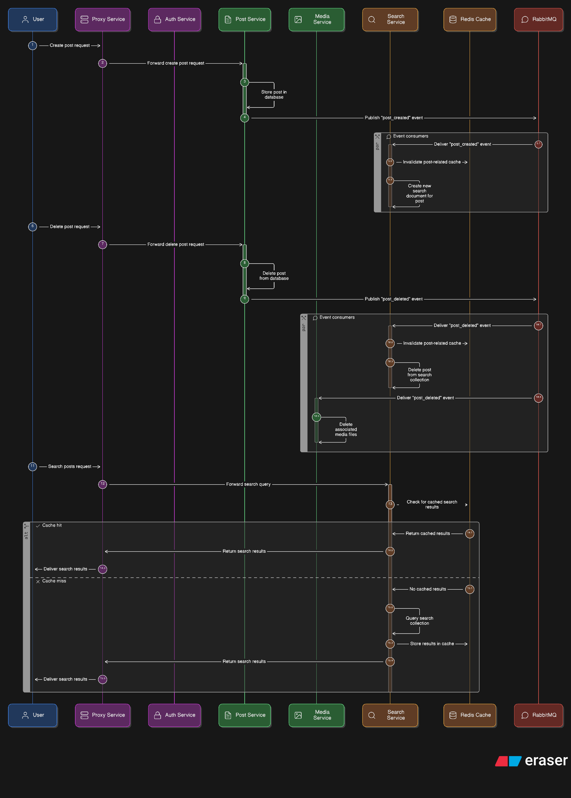

(The file `b:\projects\media\readme.md` exists, but is empty)
# Social Media Microservices

This repository contains a small social-media microservices example composed of 5 services and two infrastructure services (Redis and RabbitMQ):

- api-gateway
- identity-service (auth)
- post-service
- media-service
- search-service
- redis (state/cache)
- rabbitmq (event bus)

Each service is a small Express.js application with its own responsibilities and can be run individually or together using Docker Compose.

## Quick architecture

- Clients talk to the `api-gateway` which proxies requests to backend services under `/v1/*` paths.
- `identity-service` handles user registration, login, refresh tokens and logout. It issues JWT access tokens and stores refresh tokens in MongoDB.
- `post-service` manages posts and publishes events to RabbitMQ when posts are created or deleted.
- `media-service` handles file uploads to Cloudinary and consumes post deletion events to remove associated media.
- `search-service` indexes and searches post content; it consumes post.created and post.deleted events to keep its index up to date.
- `redis` is used by services for rate limiting and caching.

## Architecture Diagram



## Run with Docker Compose (recommended for local dev)

Environment files for each service are expected next to each service folder (e.g. `identity-service/.env`).

From the repository root run:

```powershell
docker-compose build
docker-compose up
```

This starts:

- api-gateway -> mapped to port 3000
- redis -> 6379
- rabbitmq (management UI on 15672)

Check each service `README.md` in the service folders for service-specific environment variables and ports.

## Services & Endpoints (via API Gateway)

The API Gateway exposes the following top-level paths (it proxies to the services):

- /v1/auth/* -> Identity service (`/api/auth/*` internally)
- /v1/posts/* -> Post service (`/api/posts/*` internally) — protected (requires JWT)
- /v1/media/* -> Media service (`/api/media/*` internally) — protected (requires JWT)
- /v1/search/* -> Search service (`/api/search/*` internally) — protected (requires JWT)

Refer to each service README for the exact routes and request/response shapes.

## Development

- Each service contains `start` and `dev` npm scripts in its `package.json`.
- To run a single service locally (e.g., identity-service):

```powershell
cd identity-service
npm install
npm run dev
```

## Notes & Next steps

- Add `.env.example` files for each service to document environment variables and secrets.
- Add simple integration tests that start services with in-memory databases (or test containers) and exercise key endpoints.
- Add CI pipeline to lint, test, and build Docker images.

---

Below are service-specific READMEs included in their folders for quick reference.
